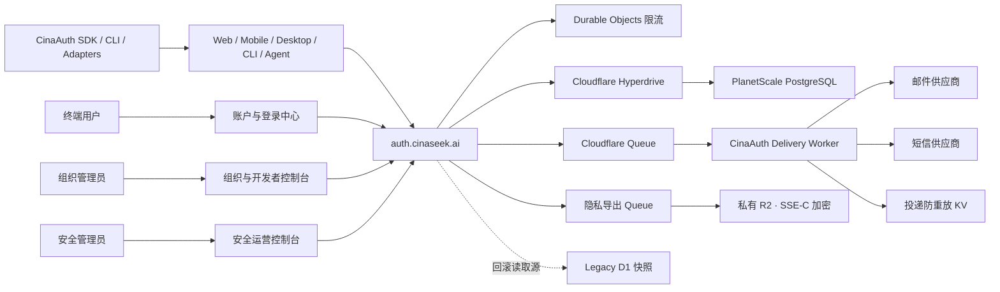

# CinaAuth 完整功能设计

> 文档状态：基于当前仓库与 `auth.cinaseek.ai` 生产部署的产品蓝图。
>
> 设计原则：保持 CinaAuth 品牌、域名、产品体验与运营体系自主；兼容 OAuth 2.0、OpenID Connect、WebAuthn、SAML 2.0、SCIM 2.0 等开放标准；明确区分“后端已实现”“需要配置”“需要产品界面”和“规划能力”。

## 1. 产品定位

CinaAuth 不应只被定义为一个登录 SDK，也不应只是一组 Better Auth 上游能力的品牌替换。完整产品由四部分组成：

1. **身份框架**：供 TypeScript 应用自托管的核心库、插件、适配器、客户端 SDK 和 CLI。
2. **托管身份服务**：运行在 `auth.cinaseek.ai` 的统一认证 API、OAuth/OIDC Issuer 和企业身份网关。
3. **身份管理产品**：面向终端用户、组织管理员、开发者和安全管理员的完整控制台。
4. **运营安全平台**：限流、审计、通知、迁移、健康检查、保留策略和事件响应能力。

一句话介绍：

> CinaAuth 是 CinaGroup 自主品牌的开发者优先身份平台，同时支持消费级登录、企业级 SSO/SCIM、OAuth/OIDC 授权、API 与 Agent 身份，以及 Cloudflare 边缘部署。

### 1.1 产品目标

- 一个账号可安全访问 CinaSeek、CinaShop、内部管理后台和第三方集成。
- 一个组织可独立管理成员、角色、团队、SSO、SCIM、应用和审计数据。
- 一个开发者可在不自行拼接认证组件的情况下完成 Web、移动端、桌面端、API、CLI、设备和 Agent 接入。
- 一个安全管理员可查看事件、封禁账号、撤销会话、处理风险并证明操作可审计。
- 平台可在 Cloudflare Workers 上水平扩展，同时把权威身份数据保存在 PostgreSQL。

### 1.2 非目标

- 不把 Cloudflare Access 头部、社交供应商身份或上游项目品牌当作 CinaAuth 的产品身份。
- 不让业务应用直接访问认证数据库。
- 不在所有查询上盲目启用缓存；认证一致性优先于数据库读延迟。
- 不把“插件已加载”视为“用户流程已完成”。前端入口、供应商配置、投递和端到端验收必须同时成立。

## 2. 总体架构



### 2.1 平面划分

| 平面 | 职责 | 当前状态 |
| --- | --- | --- |
| 身份数据平面 | 登录、令牌、会话、组织、OAuth、SSO、SCIM | Worker 已上线，PostgreSQL 已切换 |
| 体验平面 | 登录、注册、账户安全、组织和授权确认页面 | 有 Next.js 演示页面，但尚未形成完整生产闭环 |
| 控制平面 | 应用、密钥、企业连接、策略、品牌和环境管理 | API 能力较多，统一控制台仍需建设 |
| 运营平面 | 审计、告警、封禁、迁移、健康、投递、留存 | 后端主体已实现，运营界面和告警闭环需补齐 |

## 3. 用户、租户与权限模型

### 3.1 角色

| 角色 | 作用域 | 核心权限 |
| --- | --- | --- |
| 终端用户 `user` | 全局账号 | 管理个人资料、登录方式、会话、授权和组织成员关系 |
| 组织成员 `member` | 单个组织 | 使用组织应用和被授予的业务资源 |
| 组织管理员 `admin` | 单个组织 | 管理成员、邀请、团队和普通组织配置 |
| 组织所有者 `owner` | 单个组织 | 管理组织、企业连接、SCIM、账单和高风险操作 |
| 安全管理员 `security_admin` | CinaAuth 全局 | 查询用户、封禁/解封、撤销会话、查看统计与审计；不能创建/删除用户或冒充用户 |
| 超级管理员 `super_admin` | CinaAuth 全局 | 完整用户与安全管理，包括角色、密码、删除和受控冒充 |
| 服务身份 | 应用或后台任务 | 使用 API Key、OAuth Client、Bearer Token 或受限服务密钥调用 API |

全局管理角色与组织角色必须分离。一个用户可以是全局普通用户，同时在某个组织中是 `owner`，但这不自动授予 CinaAuth 全局管理权限。

### 3.2 权限设计

- 默认拒绝：未声明权限的角色不能执行管理操作。
- 新鲜会话：改密码、关闭 MFA、删除账号、旋转密钥等高风险操作要求近期重新认证。
- 逐资源授权：组织、团队、OAuth Client、API Key、SSO 和 SCIM 连接都必须绑定所有者或组织。
- 服务身份不继承用户控制台权限。
- 管理员冒充必须显示持续提示、限定时长，并写入不可否认的审计记录。

## 4. 完整功能地图

状态说明：

- **已启用**：生产 Worker 当前加载并有对应数据库结构。
- **条件启用**：代码已实现，但只有配置供应商凭据后才会加载。
- **框架能力**：库中可用，但当前生产配置未加载。
- **需产品化**：后端能力存在，缺少完整界面、配置或端到端运营闭环。
- **建议新增**：为完整商业产品补充的能力。

### 4.1 账号与基础认证

| 功能 | 设计 | 状态 |
| --- | --- | --- |
| 邮箱密码注册/登录 | 邮箱唯一、密码策略、验证状态、登录后回跳 | 已启用 |
| 邮箱验证 | OTP 验证，OTP 仅以哈希形式保存 | 已启用；依赖邮件投递 |
| 忘记/重置密码 | 邮件链接和邮箱 OTP 两条路径 | 已启用；依赖邮件投递 |
| 用户名登录 | 唯一用户名、可用性检查、用户名登录 | 已启用；UI 需补齐 |
| 匿名账号 | 临时账号登录，绑定正式身份后合并并清理匿名账号 | 已启用；UI 需补齐 |
| 账号删除 | 支持回调确认、会话和关联身份清理 | 已启用；账户中心需补齐 |
| 邮箱变更 | 新邮箱验证、敏感操作保护 | 已启用；账户中心需补齐 |
| 密码泄露检查 | Have I Been Pwned 密码风险检查 | 已启用 |

### 4.2 无密码、多因素和 Web3 身份

| 功能 | 设计 | 状态 |
| --- | --- | --- |
| Magic Link | 一次性链接、哈希存储、过期和重放保护 | 代码已启用；仅在邮件投递就绪时对外开放 |
| 邮箱 OTP 登录 | 发送、校验、过期、错误次数控制 | 代码已启用；仅在邮件投递就绪时对外开放 |
| 手机 OTP | 手机注册/登录和手机重置密码 | 代码已启用；仅在短信投递就绪时对外开放 |
| Passkey/WebAuthn | 注册、登录、重命名、查看和删除凭据 | 已启用；登录入口已有，管理界面需补齐 |
| TOTP MFA | 二维码绑定、校验、开启和关闭 | 已启用；基础页面已有 |
| 邮件 OTP MFA | 登录二次验证 | 代码已启用；仅在邮件投递就绪时对外开放 |
| 恢复码 | 生成、轮换、单次使用 | 已启用；下载和重新生成体验需完善 |
| SIWE 钱包登录与管理 | Ethereum Personal Sign 地址恢复、登录、当前用户钱包关联、主钱包切换与解绑 | 已实现；Security Center 已接入，生产浏览器钱包签名仍需真机验收 |
| 风险触发 MFA | 新设备、异常位置、高风险操作时提升认证等级 | 建议新增 |

个人钱包产品面已按以下服务端契约实现，并接入 Security Center：

- `POST /siwe/link-wallet`：要求已登录且会话新鲜；消费单次 nonce、完整校验 ERC-4361 域名/地址/链 ID/时间边界和签名，把钱包关联到当前用户，禁止已属于其他用户的钱包被抢占。
- `GET /siwe/list-wallets`：仅返回当前用户的钱包地址、链 ID、主钱包标记和绑定时间，不接受客户端指定任意 `userId`。
- `POST /siwe/set-primary-wallet`：验证目标钱包属于当前用户后原子切换唯一主钱包，并写入审计日志。
- `POST /siwe/unlink-wallet`：要求权威新鲜会话；解绑 `walletAddress` 与对应 SIWE account，并禁止删除最后一个可用登录身份；删除主钱包时必须原子选出新的主钱包。
- 现有 `/siwe/verify` 是登录端点，不得在已登录状态下被前端误用为“关联钱包”。当前实现会按钱包查找或创建账号，不保证关联到当前会话用户。

### 4.3 会话、设备与账号关联

| 功能 | 设计 | 状态 |
| --- | --- | --- |
| 会话查询 | 获取当前会话和用户信息 | 已启用 |
| 多设备会话 | 列出设备、切换活动会话、单独撤销 | 已启用；仪表盘已有部分入口 |
| 全部/其他会话撤销 | 账号泄露时快速止损 | 已启用 |
| Cookie 会话缓存 | 签名 Cookie 缓存 5 分钟，降低 PostgreSQL 读取 | 已启用；敏感/新鲜会话中间件在有服务端会话存储时强制权威读取，已撤销缓存会话不能执行敏感操作 |
| 账号关联 | 关联/解除社交账号、访问令牌刷新 | 已启用；控制界面需补齐 |
| 最近登录方式 | 记录并提示上一次登录方式 | 已启用 |
| 一次性令牌 | 生成和校验短期单用途令牌 | 已启用 |
| Bearer/JWT | API 使用 Bearer Token，提供 JWKS 和 JWT 发行 | 已启用 |

### 4.4 社交登录和外部身份

| 功能 | 设计 | 状态 |
| --- | --- | --- |
| Google/GitHub/Microsoft/Vercel | 标准社交登录、回调、账号关联 | UI 已展示，但生产 Worker 尚未配置对应 `socialProviders`，当前不能视为可用 |
| Generic OAuth | 通过受控 JSON 配置接入标准 OAuth/OIDC 供应商 | 条件启用；当前缺少配置 |
| Google One Tap | Google 快速登录 | 条件启用；当前缺少 Client ID |
| OAuth Popup/Proxy | 跨窗口和代理回调，适配预览/桌面场景 | 已启用 |
| 企业 SSO | OIDC 和 SAML 2.0，支持域名发现和组织自动加入 | 已启用；权威连接清单、OIDC/SAML Provider 生命周期与 DNS 验证向导已接入，生产 IdP 互操作验收待补齐 |
| 域名验证 | 组织证明域名所有权后启用自动路由和自动配置 | 已启用；Owner/Admin 可生成逐域 TXT 指引并触发权威 DNS 验证 |

### 4.5 组织、团队和企业目录

| 功能 | 设计 | 状态 |
| --- | --- | --- |
| 组织生命周期 | 创建、查看、更新、删除、切换活动组织 | 已启用；仪表盘已有基础入口 |
| 成员管理 | 邀请、接受/拒绝、移除、离开、修改角色 | 已启用；成员列表、移除、静态及动态多角色调整与安全离开组织控制台已完成；唯一 Owner 必须先转移所有权 |
| 邀请管理 | 查看、取消、过期和重新发送 | 已启用；待处理邀请查看、复制链接和取消 UI 已完成，邮件模板与重新发送待补齐 |
| 自定义组织角色 | 创建、更新、删除角色并检查权限 | 已启用；Owner/Admin 可在固定资源/动作矩阵内管理最多 25 个组织角色，成员可持有多个静态或动态角色，服务端再次检查权限子集与角色存在性 |
| 团队 | 团队创建、成员、活动团队和团队角色 | 已启用；每组织最多 50 个团队、每团队最多 100 名现有组织成员，支持创建、重命名、删除和按需加载的成员增删；最后一个团队默认不可删除 |
| SCIM 2.0 | Provider Token、用户增删改查、Schema 与 ResourceType 发现 | 已启用；组织级 Token 创建/轮换/撤销 UI 已接入，Token 仅显示一次且哈希保存，生产 IdP 互操作认证待完成 |
| 自动配置 | SSO 登录后按验证域名加入组织，默认角色 `member` | 已启用 |

### 4.6 OAuth、OIDC、设备与 Agent 身份

| 功能 | 设计 | 状态 |
| --- | --- | --- |
| OIDC Discovery/JWKS | 标准发现文档、签名密钥和 UserInfo | 已启用 |
| OAuth Client | 创建、更新、删除、查看和旋转 Client Secret | 已启用；个人开发者控制台已接入，组织级应用待补齐 |
| Authorization Code + PKCE | 浏览器和原生应用授权 | 已启用 |
| Refresh Token | 续期、撤销、轮换和审计 | 已启用 |
| Token Introspection/Revoke | 资源服务校验和注销令牌 | 已启用 |
| Consent | 授权确认、查看和撤销用户授权 | 已启用；确认页和个人授权撤销页已接入 |
| Dynamic Client Registration | 允许动态注册，但禁止匿名注册 | 已启用 |
| Pairwise Subject | 针对不同 Client 产生不可关联的用户标识 | 已实现；正式商用应设置独立 `OAUTH_PAIRWISE_SECRET` |
| Device Authorization | TV、CLI 和无浏览器设备的 Device Code 流程 | 已启用；审批页面已有，生产仅接受已登记且启用的原生公共 Client |
| MCP/Agent Auth | MCP 发现、动态客户端注册、授权、令牌与会话 | 框架能力存在；当前生产插件列表未加载 MCP 插件 |
| Electron | 桌面协议回调和代理 | 已启用 |
| Expo/移动端 | 移动 SDK 和深链集成 | SDK 已发布；需要生产样板与 E2E |

### 4.7 API Key 与服务身份

| 功能 | 设计 | 状态 |
| --- | --- | --- |
| API Key 生命周期 | 创建、一次性查看、重命名、列出、启停和撤销 | 已启用；个人安全中心已形成产品闭环 |
| Key 权限 | 权限、元数据、前缀、过期时间和引用主体 | 已启用 |
| Key 限额 | 时间窗口、请求上限、剩余额度、补充周期 | 已启用 |
| 组织级 Key | 组织拥有并按角色授权 | 当前生产配置把 Key 限定为用户引用；建议作为下一阶段能力 |
| 服务账号 | 非人类主体、最小权限、密钥轮换和负责人 | 建议新增独立模型，而不是复用普通用户 |

个人 API Key 的生产约束：

- 新密钥使用 `cina_sk_` 品牌前缀，用户必须填写可识别的工作负载名称，并选择 30、90 或 365 天有效期。
- 完整密钥只在创建响应和一次性确认弹窗中出现；数据库仅保存不可逆哈希，后续列表、更新和 SSR 数据桥只返回展示安全的起始字符与元数据。
- 创建、重命名、启停和撤销必须使用绕过 Cookie 缓存的权威数据库会话，并要求登录时间不超过 15 分钟；前端禁用不是授权边界。
- 撤销立即删除密钥记录；创建、更新和撤销均写入稳定审计 action，不把完整密钥写入日志、Toast、URL 或持久化浏览器存储。

### 4.8 管理、安全和审计

| 功能 | 设计 | 状态 |
| --- | --- | --- |
| 用户管理 | 查询、创建、更新、删除、修改角色和密码 | API 已启用；现有演示管理页角色判断不匹配生产角色 |
| 账号处置 | 封禁、解封、重置 2FA、解绑钱包 | 已启用 |
| 会话处置 | 查看和撤销用户会话 | 已启用 |
| 受控冒充 | 仅超级管理员可使用，并记录审计 | API 已启用；UI 安全护栏需加强 |
| 安全统计 | 总览、注册趋势、当日安全指标 | 已启用 |
| 审计日志 | 自动捕获、查询、导出、写入服务事件和告警聚合 | 已启用；组织高风险动作写入租户目标，Owner/Admin 可查询脱敏后的本组织事件 |
| 留存 | 每日清理过期会话，审计日志默认保留 90 天 | 已启用 |
| 安全告警 | 登录爆破、异常 IP、权限提升和批量导出告警 | 审计已有 alerts API；通知与事件响应闭环需新增 |
| 数据主体请求 | 导出个人数据、删除证明、保留例外 | 同步/异步加密导出、删除就绪检查、阻塞性保留检查、外部处理方幂等擦除编排与 HMAC 签名删除回执已实现；生产擦除 Worker、SQLite Durable Object、共享 Secret 与 Auth 失败关闭接入已部署，当前真实下游目标列表为空，账户删除会返回 503 并保持本地账户不变；下游适配器与备份到期证明待配置 |

### 4.9 计费与商业化

| 功能 | 设计 | 状态 |
| --- | --- | --- |
| Stripe 客户/订阅 | 用户或组织客户、订阅列表、升级、取消、恢复、Portal | 条件启用；只有 Secret、Webhook、Price 和版本化 Entitlement 策略同时有效才开放 Billing。当前生产未配置完整四元组，账号中心失败关闭，不查询订阅或展示可点击结账动作 |
| 计划与席位 | 免费、团队、企业计划和组织席位 | Stripe 插件已映射权威 Entitlement 策略与席位上限；组织订阅仅 Owner/Admin 可管理。产品定价、Price ID 和迁移策略确认前不固化演示套餐为生产合同 |
| 使用量计费 | MAU、SMS、企业连接、API 请求和审计保留 | 建议新增计量账本，避免从业务表临时聚合账单 |
| 权益控制 | 按计划控制 SSO、SCIM、组织审计、团队、动态角色、OAuth Client、API Key 与配额 | 共享版本化契约、严格策略解析、Worker 权威评估端点和账号中心双重门控已完成；未配置 Billing 时显式返回 unmetered，避免误封现有能力。各功能写端点的逐项配额强制仍待后续接入 |

### 4.10 开发者体验

| 功能 | 设计 | 状态 |
| --- | --- | --- |
| 类型安全客户端 | Vanilla、React、Vue、Svelte、Solid、Lynx | 已实现 |
| 服务端集成 | Next.js、Hono、Express、Fastify、Nest、Nuxt、SvelteKit 等 | 已有文档和适配接口 |
| 数据库适配器 | PostgreSQL/MySQL/SQLite/Mongo；Drizzle、Prisma、Kysely 等 | 已实现 |
| 运行时 | Node.js、Bun、Deno、Cloudflare Workers | 框架设计目标；发布前需维持跨运行时测试矩阵 |
| OpenAPI | Schema 生成和交互参考 | 已启用 |
| CLI | 初始化、生成 Schema、迁移和 AI 资源 | 已实现 |
| Webhook 平台 | 认证业务事件订阅、签名、重试和投递记录 | 当前只有内部通知 Webhook；建议新增通用事件 Webhook |
| 环境隔离 | Development、Preview、Production 独立 Issuer 和密钥 | 建议新增控制平面能力 |

## 5. 产品界面信息架构

### 5.1 托管登录中心

建议产品域名为 `accounts.cinaseek.ai`，`auth.cinaseek.ai` 保持纯 API/Issuer；如果继续复用现有域名，也应保持页面与 API 路由清晰分层。

```text
/sign-in                 登录方式选择
/sign-up                 注册
/forgot-password         找回密码
/two-factor              二次验证
/device                  设备码输入与授权
/oauth/consent           OAuth 授权确认
/account/select          多账号选择
/organization/select     组织选择
/invitation/:id          邀请接受
```

页面只展示后端已经配置且健康的登录方式。登录方式清单应由受控配置端点驱动，不能把 Google/GitHub 等按钮硬编码为永远可用。

### 5.2 用户账户中心

```text
/account/profile         姓名、头像、邮箱、手机号
/account/security        密码、MFA、Passkey、恢复码
/account/identities      社交账号、企业身份、钱包
/account/sessions        当前设备和历史会话
/account/authorizations  OAuth 授权与撤销
/account/api-keys        个人 API Key
/account/organizations   组织成员关系与邀请
/account/privacy         数据导出与账号删除
/dashboard/developer     个人 OAuth Client、Secret、Consent 与 Device Flow
```

### 5.3 组织与开发者控制台

```text
/console/:org/overview
/console/:org/members
/console/:org/teams
/console/:org/roles
/console/:org/applications
/console/:org/oauth-clients
/console/:org/api-keys
/console/:org/sso
/console/:org/scim
/console/:org/domains
/console/:org/security
/console/:org/audit
/console/:org/webhooks
/console/:org/branding
/console/:org/billing
```

### 5.4 内部安全运营控制台

```text
/admin/overview
/admin/users
/admin/incidents
/admin/sessions
/admin/audit
/admin/rate-limits
/admin/delivery
/admin/oauth-clients
/admin/system-health
/admin/migrations
```

内部控制台必须使用 `security_admin` / `super_admin`，不能沿用演示页的单一 `admin` 判断。

## 6. 关键业务流程

### 6.1 普通用户登录

1. 登录页从服务端获取当前可用登录方式。
2. 用户选择密码、OTP、Magic Link、Passkey、社交或 SSO。
3. Worker 先执行来源校验、限流、账号状态和密码泄露策略。
4. 命中 MFA 或风险升级条件时进入二次验证。
5. 创建数据库会话并签发安全 Cookie；可选签发 Bearer/JWT。
6. 写入登录审计，保存最近登录方式并安全回跳。

### 6.2 企业 SSO 登录

1. 用户输入企业邮箱，系统根据已验证域名发现组织连接。
2. 跳转到组织的 OIDC/SAML IdP。
3. 校验回调、Issuer、签名、Nonce/State 和受众。
4. 按组织策略自动创建或关联用户。
5. 默认以 `member` 加入组织；管理员权限不能由未受信任属性自动提升。
6. 创建会话并记录企业 IdP、组织、设备和风险上下文。

### 6.3 OAuth/OIDC 授权

1. 校验 Client、Redirect URI、Response Type、Scope 和 PKCE。
2. 未登录用户进入托管登录中心。
3. 展示 Client 品牌、申请 Scope、组织上下文和数据用途。
4. 用户授权后生成短期 Authorization Code。
5. Token Endpoint 换取 Access/Refresh Token；数据库保存可撤销状态。
6. 用户可在账户中心查看和撤销 Consent。

### 6.4 安全事件处置

1. 限流或审计规则发现异常登录、批量失败或权限提升。
2. 生成安全事件并通知值班人员。
3. `security_admin` 可封禁账号、撤销会话和要求重置 MFA。
4. `super_admin` 才能执行删除、角色调整或受控冒充。
5. 每个动作记录操作者、来源、目标、理由、结果和关联事件。

## 7. 数据模型

当前生产插件组合创建 23 张业务表，另有 1 张切换记录表：

| 数据域 | 表 |
| --- | --- |
| 核心身份 | `user`, `session`, `account`, `verification` |
| 认证能力 | `jwks`, `twoFactor`, `passkey`, `deviceCode`, `walletAddress`, `apikey`, `auditLog` |
| B2B 身份 | `organization`, `member`, `invitation`, `team`, `teamMember`, `organizationRole`, `ssoProvider`, `scimProvider` |
| OAuth 平台 | `oauthClient`, `oauthAccessToken`, `oauthRefreshToken`, `oauthConsent` |
| 运维标记 | `cinaauth_cutover_history` |

数据设计要求：

- 账号身份、会话、令牌、组织成员关系和审计是权威数据，不能依赖前端缓存做授权决定。
- OTP、Magic Link、SCIM Token 和敏感 API Key 材料必须哈希或不可逆处理。
- OAuth Client Secret、服务密钥和恢复码只在创建/旋转时显示一次。
- 审计日志与业务表分开管理保留期限；删除用户不能静默删除安全审计证据。
- Stripe 条件启用后增加 `subscription` 表及用户/组织客户字段。
- 团队与动态组织角色已通过受保护的 `/api/migrate?feature=organization-advanced` 由 Hyperdrive 数据库角色先行迁移：新增 `team`、`teamMember`、`organizationRole`，并增加 `session.activeTeamId` 与 `invitation.teamId`；预览严格匹配后才启用运行时，生产请求不会隐式变更 Schema。

## 8. API 与协议设计

### 8.1 路由边界

- `/api/auth/*`：公共认证与已认证用户 API。
- `/.well-known/*`：OIDC/OAuth/MCP 发现文档。
- `/api/ready`：受保护的生产就绪检查。
- `/api/migrate`：受保护的 Schema 预览与应用。
- `/api/migrate/d1`：仅维护模式、仅一次性凭据可用的数据切换接口。
- `/api/auth/admin/*`：全局管理员 API。
- `/api/auth/organization/*`：组织管理 API。
- `/api/auth/oauth2/*`：OAuth/OIDC 授权服务器 API。
- `/api/auth/scim/v2/*`：SCIM 2.0 API。

### 8.2 API 一致性

- 所有响应使用稳定错误码、HTTP 状态码和请求关联 ID。
- 所有写操作支持审计；可重试写操作需要幂等键。
- 管理列表采用一致的分页、排序和过滤模型。
- OpenAPI 文档必须只公开当前启用的插件端点。
- 破坏性 API 变更必须版本化，不能依靠 UI 同步上线掩盖兼容性问题。

## 9. 安全与风险控制

### 9.1 当前生产基线

- `auth.cinaseek.ai` 使用显式可信 Origin，不使用通配子域。
- 登录路径默认每个限流键 60 秒最多 5 次；其他认证请求默认 60 秒最多 300 次。
- OAuth Token、Authorize、Introspect、Revoke、Register 和 UserInfo 有独立限流。
- Durable Objects 把限流键分散到 256 个稳定分片并串行化计数变更。
- PostgreSQL 经 Hyperdrive 访问；Hyperdrive 查询缓存关闭。
- 健康、迁移、错误和管理策略响应显式设置 `Cache-Control: no-store`；认证端点应继续由框架测试保证不会被共享缓存保存。
- 维护状态默认拒绝认证流量，只开放健康与迁移路径。
- 数据库就绪门检查核心表和 D1 切换标记。
- 通知通过 Queue 解耦；Auth Worker 通过 Service Binding 调用 Delivery Worker，Webhook 使用 HMAC、时间窗和 Delivery ID，Delivery Worker 使用 KV 防重放。Auth 以内部鉴权的逐通道 readiness 动态发布能力，供应商未就绪时在生成凭据和入队前返回 503，前端同时隐藏对应入口。
- 大型个人数据导出通过独立 Queue 流式生成；清单与数据对象以主体 HMAC 分区，并使用派生的逐对象 SSE-C 密钥写入私有 R2。下载要求近期会话与主体匹配，对象最长保留 24 小时。
- 账户删除先调用独立 Privacy Erasure Worker，再由每个稳定操作号对应的 SQLite Durable Object 调用所有已登记外部处理方并保证重试幂等。任何处理方处于 pending、失败、返回无效证据，或生产目标列表为空时，本地账户保持不变。完成回执只记录操作号和供应商证据的 HMAC 摘要，不暴露原始证据或主体标识；它证明 CinaAuth 签署了适配器声明，不冒充供应商存储的独立密码学擦除证明。
- 每日清理过期会话和超过 90 天的审计日志。

### 9.2 需要补充的商业安全能力

- 启用 Cloudflare Turnstile，并针对注册、找回密码和高风险登录使用分级挑战。
- 独立设置 `OAUTH_PAIRWISE_SECRET`，不与会话签名密钥共用。
- 建立密钥版本、轮换、吊销和双密钥过渡机制。
- 引入登录风险评分：IP/ASN、地理跃迁、设备变化、失败速度、泄露凭据和组织策略。
- 对管理员和组织所有者强制 MFA/Passkey。
- 建立不可修改或外部归档的高价值审计日志通道。
- 对导出、用户删除、角色提升、SCIM Token 和 Client Secret 操作要求二次确认与近期认证。

## 10. 生产运行设计

### 10.1 当前部署

- Auth Worker：`cinaauth-api`，自定义域名 `auth.cinaseek.ai`。
- 数据库：PlanetScale PostgreSQL，经 Hyperdrive `374f6da17aff4c968cadd8d6aa454c22`。
- Hyperdrive 上游连接上限：15；Worker 本地 Pool 最大 5，并快速释放空闲连接。
- 限流：`RateLimitDurableObject`。
- 投递：Auth Worker `CINAAUTH_DELIVERY_SERVICE` -> Cloudflare Queue -> 独立 Delivery Worker -> Resend/Twilio；主队列与 DLQ 的自动化、删除策略和远端门禁统一要求最长保留 24 小时，生产控制面已核验为 86400 秒。公开能力端点、账号中心入口和认证发送端点共同按逐通道 readiness 失败关闭。
- 隐私导出：`cinaauth-privacy-export` Queue -> `cinaauth-privacy-exports` 私有 R2；失败进入独立 DLQ，R2 lifecycle 与 Worker 定时任务双重清理。
- 回滚源：只读保留的 Legacy D1。
- 定时任务：每日执行会话、审计日志和过期隐私导出对象清理。

### 10.2 SLO 建议

| 指标 | 建议目标 |
| --- | --- |
| Auth API 可用性 | 月度 99.95% |
| 非供应商登录 API P95 | 小于 300 ms |
| Token Endpoint P95 | 小于 250 ms |
| 登录投递入队 P95 | 小于 200 ms |
| 邮件/SMS 实际送达 | 按供应商拆分监控，P95 小于 60 秒 |
| 认证错误率 | 按端点和错误码监控，平台 5xx 小于 0.1% |
| 安全事件发现 | 高危小于 5 分钟 |
| 恢复时间目标 RTO | 30 分钟 |
| 数据恢复点目标 RPO | 5 分钟或更优 |

### 10.3 可观测性

- 请求：端点、状态、延迟、版本、数据中心、错误码，不记录密码、OTP、Token 或 Cookie。
- 身份：登录成功率、失败原因、MFA 完成率、Passkey 使用率、SSO/SCIM 健康。
- 限流：允许、阻止、Retry-After、分片热点和误杀申诉。
- 数据库：Hyperdrive 连接、查询延迟、超时、连接耗尽和迁移状态。
- 投递：入队、重试、供应商响应、防重放命中和最终失败。
- 管理：封禁、角色变化、导出、冒充和密钥轮换。

## 11. 品牌自主化边界

- 对外统一使用 CinaAuth 名称、视觉、Cookie 前缀、Token 前缀、Issuer、文档和支持渠道。
- 公共包继续使用 `cinaauth` / `@cinaauth/*`，不暴露上游品牌命名。
- 标准协议字段保持标准，不为品牌改名破坏 OAuth/OIDC/SAML/SCIM 兼容性。
- 上游同步与产品层解耦：核心兼容层、CinaAuth 扩展层、Cloudflare 托管层、产品 UI 层分别维护。
- 所有外部身份供应商以“连接器”出现，不能成为 CinaAuth 的主身份边界。
- 品牌文案不得宣称尚未配置或未通过端到端验证的登录方式已经可用。

## 12. 当前差距与优先级

### P0：让现有生产能力真正可用

1. ✅ **统一域名与入口（2026-08-10 已完成）**：`accounts.cinaseek.ai` 承载普通用户登录和账号中心，`admin.cinaseek.ai` 承载高权限运营后台，`auth.cinaseek.ai` 是唯一权威认证 Worker；旧 Demo 域只保留到账号中心的永久重定向。
2. ✅ **修复认证桥与同源会话（2026-08-10 已完成）**：两个前端的服务端页面和 `/api/auth/*` 代理使用真实 `AUTH_WORKER` Service Binding；浏览器始终请求当前前端 origin，代理逐条保留多个 `Set-Cookie`，避免 Cookie 被写入 Auth 域或被合并；本地服务端开发才回退到公开 Auth Worker URL。账户与管理前端保持独立 Worker 和独立流水线。
3. 🟡 **登录方式按配置展示（代码与回调边界已闭环，供应商凭据及 E2E 待补）**：Auth Worker 提供不泄密、版本化的 `/api/auth/capabilities`；账号中心通过共享契约只渲染已配置且运行时就绪的 OAuth、Email OTP、Magic Link 和 Phone OTP 入口，缺失或无效的能力响应一律失败关闭。Generic OAuth 配置现在失败关闭校验 provider ID、HTTPS discovery/endpoint 与精确账号中心回调，`/sign-in/oauth2` 和 `/oauth2/callback/*` 通过 Service Binding 时显式绕过不兼容的跨域 OAuth Proxy，保证 state/session Cookie 留在 `accounts.cinaseek.ai`。Google Client ID 已同时接入 Worker 与账号中心独立构建流水线。控制台配置、凭据写入和真实成功/失败回调仍须按 `docs/CINAAUTH_OAUTH_PRODUCTION.md` 验收后才能宣布可用。
4. ✅ **统一管理角色（2026-08-09 已完成）**：管理页、客户端类型和动作可见性已统一为 `security_admin` / `super_admin` 权限矩阵；普通 `admin` 不再获得生产管理入口。
5. 🟡 **投递验收（内部链路和失败关闭已闭环，供应商凭据待补）**：Auth Worker 通过 `CINAAUTH_DELIVERY_SERVICE` 调用 Delivery Worker，使用共享 Secret 获取邮件/短信逐通道 readiness；公开 capabilities 与账号中心入口随 readiness 动态关闭，所有会产生投递的 Auth 端点在生成凭据和入队前再次校验，不会出现“页面宣称可用但消息必然失败”的半开启状态。显式验收脚本覆盖 Email OTP、Magic Link、重置密码、手机 OTP、手机重置 OTP，并通过重复 Delivery ID 验证 KV 去重；`cinaauth-delivery.cinagroup.com` 已作为 Cloudflare Custom Domain 发布。2026-08-10 已通过 stdin 在 Auth 与 Delivery Worker 协同轮换共享 Webhook Secret；远端检查现在只剩 `RESEND_API_KEY`、`RESEND_EMAIL_FROM`、`TWILIO_ACCOUNT_SID`、`TWILIO_AUTH_TOKEN`、`TWILIO_FROM_NUMBER` 五项供应商输入。MFA OTP 共用 Email OTP 投递类型；补齐凭据后仍需用获批邮箱/手机号完成实际收件确认。
6. ✅ **开启 Turnstile（2026-08-10 已完成）**：客户端按能力发现动态加载显式 Turnstile 组件，挑战完成前禁止提交，并把一次性令牌放入 `x-captcha-response`；服务端对注册、密码登录、邮箱/手机 OTP 发送、Magic Link 和找回密码执行 Siteverify，校验 action 与 hostname，失败时关闭请求。生产 `CinaAuth Production` Managed 组件已创建，允许 `accounts.cinaseek.ai`、`admin.cinaseek.ai`、`auth.cinaseek.ai` 与迁移期旧域名，站点密钥和 Secret 已通过 Wrangler stdin 写入，线上能力端点确认 `captchaEnabled: true`。
7. 🟡 **自动化就绪检查（平台资源已闭环，外部凭据待补）**：CI 使用永久迁移/就绪凭据安全调用 `/api/ready`；远程检查器在当前进程提供 token 时验证 live cutover、数据库、运行时配置、Turnstile 域名、Queue 保留期和 Auth -> Delivery Service Binding，并把 Google、Generic OAuth、Turnstile、Stripe 的远端 Secret 清单与线上 capabilities 交叉验证；可获得 Delivery 共享 Secret 时还要求授权 provider readiness 与公开登录能力逐项一致，防止“Secret 已写入但运行时因无效配置失败关闭”被误报为可用。没有迁移凭据时明确报告跳过授权 readiness。2026-08-10 已在实时 backlog 为零的保护条件下把 Delivery 主队列和 DLQ 从 4 天缩短为 24 小时；生产控制面复查均为 86400 秒、零积压。

本轮生产证据：Auth Worker `cinaauth-api` 版本 `0d01d894-c97d-44a7-97f9-522a18014c6a` 已发布到 `auth.cinaseek.ai`，绑定 Durable Object、Queue、Legacy D1、Hyperdrive `374f6da17aff4c968cadd8d6aa454c22` 和 `CINAAUTH_DELIVERY_SERVICE -> cinaauth-delivery`；账号中心版本 `3930590e-27db-4635-820b-0a6bf99a90c9` 已发布到 `accounts.cinaseek.ai`，继续通过 `AUTH_WORKER` Service Binding 调用 Auth。线上 capabilities 为版本 3，并在五项投递供应商输入缺失时返回 `emailOtp=false`、`magicLink=false`、`phoneOtp=false`；源站和账号代理的邮箱 OTP 发送端点均在入队前返回 `503 DELIVERY_PROVIDER_UNAVAILABLE`。生产 Stripe 四元组当前未配置，线上 `billing=false`；新增 Entitlement 端点在源站与 Service Binding 代理下均对未认证请求返回 401 和 `Cache-Control: no-store`，账号中心据 live capability 与权威 Entitlement 双重失败关闭订阅查询和付费动作。`/dashboard` 保持 307 登录跳转，旧 `/admin` 保持 308 跳转至独立 `admin.cinaseek.ai`。线上视觉复查确认特色套餐为高对比黑底白字。一次性生产账户、邮件/SMS 实际收件、OAuth 回调与真实 Stripe Checkout/Webhook/Portal 仍需在供应商凭据和产品策略齐备后验收。

一次性生产账户验收已新增默认 dry-run 的 `acceptance:production-lifecycle`：只允许 Auth/Accounts 生产 origin，使用操作者显式提供的短期 `super_admin` 会话创建无密码、无真实联系方式的 `@acceptance.invalid` 合成用户，通过受审计 impersonation 验证会话签发，并在 `finally` 中删除用户后再次验证会话失效；任何清理未确认都会令验收失败并只报告非敏感 run ID。成功、主流程失败仍清理、清理失败、非法 Cookie/目标零请求和默认 dry-run 共 5 项安全测试已纳入 Auth 完整门禁。当前进程没有 `CINAAUTH_ACCEPTANCE_ADMIN_COOKIE`，因此本轮未创建生产测试账号；真实 OAuth 账号仍必须走普通用户删除与 Privacy Erasure，不能用该合成脚本绕过外部处理方。

### P1：完成用户与组织产品面

1. 🟡 **账户安全与隐私中心（代码闭环已完成，外部证据链待接）**：新增 `/dashboard/security` 与 `/dashboard/privacy`。安全中心并行加载权威会话、Passkey、个人 API Key、关联身份、SIWE 钱包和已配置 OAuth 连接器；用户可查看/撤销会话、增删 Passkey、开关 MFA、修改密码、显式关联/解绑身份、管理钱包、创建/重命名/启停/撤销 API Key 和删除账户。隐私中心提供同步机器可读 JSON 导出与 Queue → 私有 R2 的异步加密导出，并写入 `privacy.export` 审计 action；逐模型计数且超限明确失败，不静默截断，凭据秘密始终排除。删除前重新校验阻塞性保留状态并依次要求已登记外部处理方以稳定操作号返回 `completed`/`not-applicable`；pending、错误或无效证据均阻断本地删除。删除完成后自动下载不含原始用户 ID/邮箱或供应商原始证据的 HMAC-SHA256 签名回执，并提供防篡改验证接口。PlanetScale 控制台已确认生产备份每 12 小时运行、保留 2 天；2026-08-10 对当时全部 4 条 `main` 备份逐条检查，删除保护均为关闭。该结果是当前控制面全量快照，不替代持续审计；仍需只读 `read_backups` 服务令牌自动证明后续备份及删除回执截止时间后的 `deleted_at` 状态，并配置真实 `CINAAUTH_ERASURE_WEBHOOK_*` 处理方适配器。
2. 🟡 **组织成员控制台（成员、邀请、团队、动态角色、离开组织、租户审计与企业连接代码闭环已完成）**：新增 `/dashboard/organization`，服务端加载组织列表、活动组织权威数据、团队、动态角色，以及仅 Owner/Admin 可见的本组织安全事件和 SSO/SCIM 权威连接清单；支持组织创建/切换、成员查看/移除、静态与动态多角色调整、团队创建/重命名/删除及成员增删、成员邀请、待处理邀请链接复制与取消，以及带二次确认的离开组织。动态角色编辑器只允许内置 `organization`、`member`、`invitation`、`team`、`ac` 资源的已声明动作；最终权限子集、租户归属和角色存在性仍由 Worker 复核。团队成员仅从现有组织成员中选择，成员清单按团队对话框按需加载，避免无界 N+1。SSO 控制台支持 OIDC Discovery/手工端点和 SAML Metadata/手工证书两种注册方式、非敏感配置编辑、凭据成对轮换、精确 Provider ID 删除确认、回调地址复制，以及按多域生成 TXT 记录并触发权威核验；已存凭据不会加载到浏览器，删除会明确提示同步移除关联 SSO 账户记录。SCIM 支持创建、轮换和撤销组织级 Token，明文只在当前页面内存中显示一次。审计插件将组织高风险动作绑定到 `targetType=organization` 和权威组织 ID；租户查询再次复核成员角色，并从响应中排除 IP 与 User-Agent。审计控制台支持 UTC 日期、action、成功/失败筛选，25 条分页浏览，以及当前筛选结果的版本化 JSON 和 CSV 导出；导出按 100 条分批拉取，超过 10,000 条或分页期间权威总数漂移时明确失败，CSV 单元格防公式注入，不会静默截断。所有组织写操作要求 15 分钟内的近期认证和权威组织数据；唯一 `owner` 必须先转移所有权。真实 OIDC/SAML IdP 互操作仍待建设。
3. 🟡 **个人开发者控制台（代码闭环已完成，真实协议 E2E 待验收）**：新增 `/dashboard/developer`，并行加载当前用户拥有的 OAuth Client 与 Consent；支持 Web 机密 Client 和 Native 公共 PKCE Client 的创建、编辑、删除、Secret 旋转、一次性密钥确认、回调 URI/Scope 管理和授权撤销。Worker 端要求已验证、非匿名账户，逐 Client 强制所有权，并对所有写操作绕过 Cookie 缓存校验 15 分钟内的权威会话。Device Flow 仅接受已登记、启用的公共 Client。仍需用一次性验证账户完成 Authorization Code + PKCE、旧 Secret 失效、新 Secret 生效、Device Flow、非法 Client 拒绝和 Consent 撤销的生产 E2E；组织级 Client 所有权仍待建设。
4. 🟡 **高风险操作保护（账户、组织、企业连接和个人开发者范围已完成代码闭环）**：账户安全中心对会话、MFA、Passkey、身份和账户删除执行近期认证与明确确认；组织管理、SSO Provider 注册/更新/删除、域名验证、SCIM Token 创建/撤销与 OAuth Client 写操作均由 Worker 复核 15 分钟内的权威数据库会话，已有控制台同时提供禁用态保护。Secret 只在创建/旋转时提交或显示，已存 OIDC/SAML 凭据不回填前端；Provider 删除要求输入完整 ID 并告知关联账户影响，审计插件记录稳定 action。账号中心已提供租户隔离的企业连接清单、完整 OIDC/SAML Provider 基础配置、SSO DNS 验证与 SCIM Token 生命周期；真实 IdP 协议互操作、算法/声明映射等高级选项和计费仍需逐项验收。

### P2：企业商业化

1. Entitlement 权威契约、Stripe 原子配置门禁、Webhook 同步订阅评估和 Owner/Admin 组织计费授权已完成代码闭环；仍需批准生产套餐/Price、配置 Stripe 四元组、逐功能接入配额强制并完成真实 Checkout/Webhook/Portal E2E。
2. 提供组织级 API Key、服务账号、Webhook 和环境隔离。
3. 完成主流 IdP 的 OIDC/SAML/SCIM 互操作认证。
4. 企业审计 JSON/CSV 自助导出与安全上限已完成代码闭环；仍需补齐异步大规模导出、可配置保留策略、数据驻留和支持流程。

### P3：规模化安全和平台生态

1. 风险引擎、Step-up MFA、设备信任和异常检测。
2. 多区域灾备、密钥轮换、恢复演练和容量压测。
3. MCP/Agent 身份正式接入生产插件组合。
4. 应用市场、连接器模板和自助开发者门户。

## 13. 完成验收标准

CinaAuth 只有同时满足以下条件，才可以称为“完整可商用身份平台”：

- 所有在 UI 中展示的登录方式都通过真实供应商端到端测试。
- 用户可以自助完成注册、登录、找回、MFA、Passkey、会话撤销和账号删除。
- 组织可以自助完成成员、邀请、角色、SSO、SCIM、OAuth Client 和审计管理。
- 管理员权限与生产角色一致，所有敏感动作可审计且要求近期认证。
- API、SDK、OpenAPI 和示例使用同一个生产域名与协议契约。
- 邮件和短信具备签名、防重放、重试、失败告警和送达指标。
- 认证数据库、限流、Queue、Delivery、迁移和就绪检查有自动化监控。
- 关键安全策略、密钥轮换、备份恢复和事故响应经过演练。
- 品牌、文档、域名和控制台不依赖上游项目身份，协议兼容性仍然保持。

## 14. 当前结论

CinaAuth 的后端基础已经覆盖多数成熟身份平台需要的协议与功能：密码和无密码登录、MFA、Passkey、组织、OAuth/OIDC、SSO、SCIM、API Key、设备授权、审计、管理、限流和 Cloudflare 生产架构均有实际代码支撑。

当前最大的短板不是“缺少认证插件”，而是**产品面没有把这些能力闭环**：演示 UI、生产域名、供应商配置、管理角色、服务端桥接、企业控制台和运营验收仍然存在断点。因此下一阶段应先完成 P0/P1，而不是继续无边界增加插件。

## 15. 源码依据

- 托管 Worker：[workers/auth-api/src/index.ts](workers/auth-api/src/index.ts)
- 生产认证配置：[workers/auth-api/src/auth.ts](workers/auth-api/src/auth.ts)
- 生产插件组合：[workers/auth-api/src/plugins.ts](workers/auth-api/src/plugins.ts)
- Durable Object 限流：[workers/auth-api/src/rate-limit.ts](workers/auth-api/src/rate-limit.ts)
- Hyperdrive 数据库：[workers/auth-api/src/database.ts](workers/auth-api/src/database.ts)
- D1 切换迁移：[workers/auth-api/src/d1-migration.ts](workers/auth-api/src/d1-migration.ts)
- 通知队列：[workers/auth-api/src/delivery.ts](workers/auth-api/src/delivery.ts)
- Delivery Worker：[workers/delivery/src/index.ts](workers/delivery/src/index.ts)
- 隐私擦除入口：[workers/privacy-erasure/src/index.ts](workers/privacy-erasure/src/index.ts)
- 隐私擦除持久化编排：[workers/privacy-erasure/src/coordinator.ts](workers/privacy-erasure/src/coordinator.ts)
- 账号中心客户端配置：[apps/account-portal/lib/auth-client.ts](apps/account-portal/lib/auth-client.ts)
- 账号中心服务端认证桥：[apps/account-portal/lib/auth.ts](apps/account-portal/lib/auth.ts)
- 核心 API：[packages/cinaauth/src/api/routes](packages/cinaauth/src/api/routes)
- 内置插件：[packages/cinaauth/src/plugins](packages/cinaauth/src/plugins)
