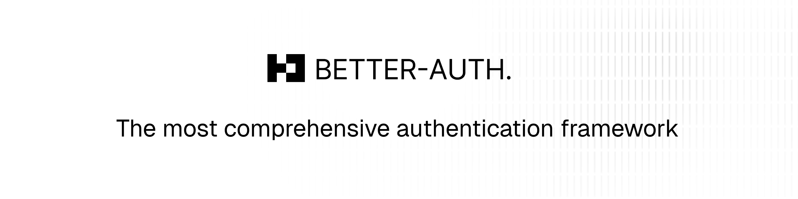



  <picture>
    <source srcset="./banner-dark.png" media="(prefers-color-scheme: dark)"/>
    <source srcset="./banner-light.png" media="(prefers-color-scheme: light)"/>
    
  </picture>

  
  
  

  

    <a href="https://discord.gg/cinaauth">Discord</a>
    ·
    <a href="https://cinagroup.com">Website</a>
    ·
    <a href="https://github.com/cinagroup/cinaauth/issues">Issues</a>
  

## CinaAuth

CinaAuth is a framework-agnostic authentication (and authorization) framework for TypeScript. It provides a comprehensive set of features out of the box and includes a plugin ecosystem that simplifies adding advanced functionalities with minimal code in a short amount of time. Whether you need 2FA, multi-tenant support, or other complex features, it lets you focus on building your actual application instead of reinventing the wheel.

### Why CinaAuth

Authentication in the TypeScript ecosystem is a half-solved problem. Other open-source libraries often require a lot of additional code for anything beyond basic authentication. Rather than just pushing third-party services as the solution, I believe we can do better as a community—hence, CinaAuth.

## Contribution

CinaAuth is a free and open source project licensed under the [MIT License](./LICENSE.md). You are free to do whatever you want with it.

You could help continuing its development by:

- [Contribute to the source code](./CONTRIBUTING.md)
- [Suggest new features and report issues](https://github.com/cinagroup/cinaauth/issues)

## Security
If you discover a security vulnerability within CinaAuth, please send an e-mail to [security@cinagroup.com](mailto:security@cinagroup.com).

All reports will be promptly addressed, and you'll be credited accordingly.
