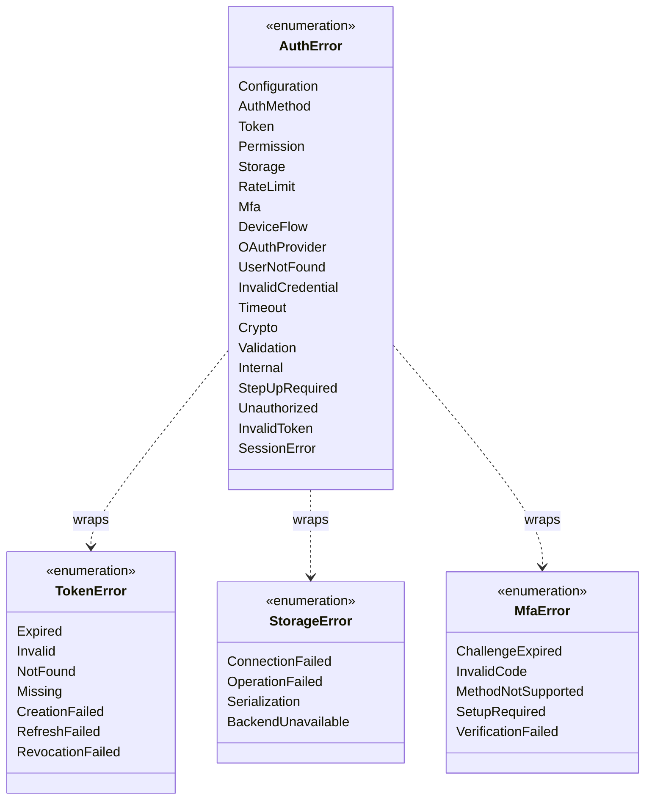

# Package: errors
> `src/error.rs` — top-level error types used throughout the framework

> [index](23-cross-package.md) · [02-config →](02-config.md)

---

**Related:** [02-config](02-config.md) · [03-tokens](03-tokens.md) · [04-storage](04-storage.md) · [22-core](22-core.md)
