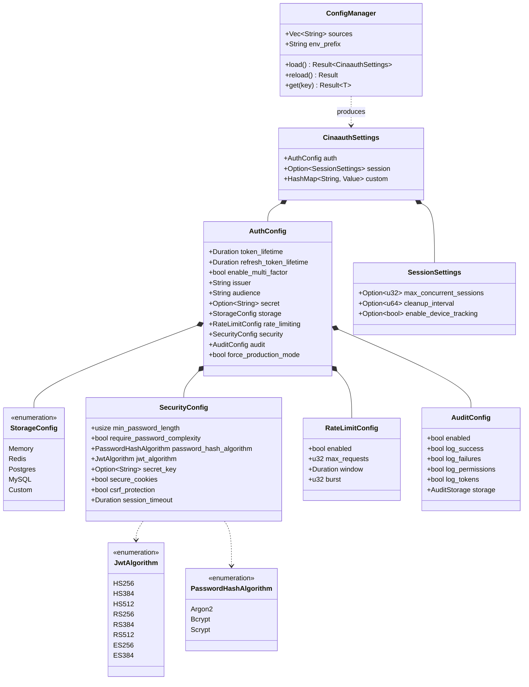

# Package: config

> `src/config/` — centralised configuration for the framework

> [← 01-errors](01-errors.md) · [index](23-cross-package.md) · [03-tokens →](03-tokens.md)

---

**Related:** [01-errors](01-errors.md) · [03-tokens](03-tokens.md) · [22-core](22-core.md)
