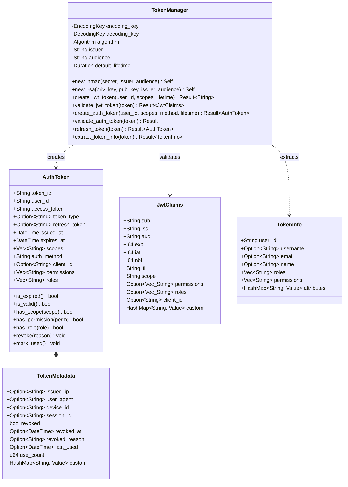

# Package: tokens

> `src/tokens.rs` — JWT generation, validation, and token lifecycle

> [← 02-config](02-config.md) · [index](23-cross-package.md) · [04-storage →](04-storage.md)

---

**Related:** [02-config](02-config.md) · [12-security](12-security.md) · [14-oauth2-domain](14-oauth2-domain.md) · [22-core](22-core.md)
