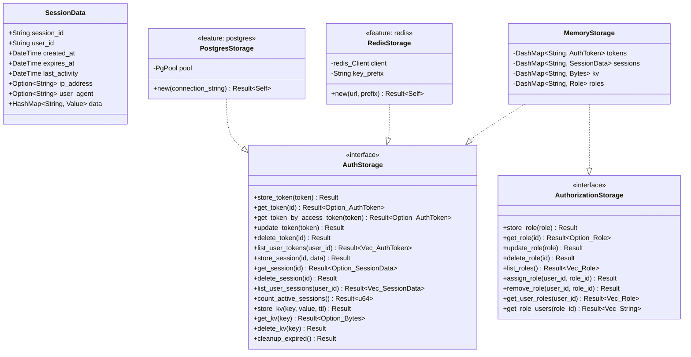

# Package: storage

> `src/storage/` — AuthStorage trait and concrete backends

> [← 03-tokens](03-tokens.md) · [index](23-cross-package.md) · [05-user-context →](05-user-context.md)

---

**Related:** [07-methods](07-methods.md) · [08-permissions](08-permissions.md) · [11-session](11-session.md) · [13-audit](13-audit.md) · [14-oauth2-domain](14-oauth2-domain.md) · [22-core](22-core.md)
