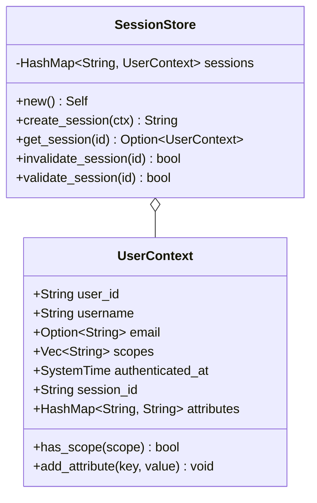

# Package: user_context

> `src/user_context.rs` — in-memory session store and user context

> [← 04-storage](04-storage.md) · [index](23-cross-package.md) · [06-providers →](06-providers.md)

---

**Related:** [11-session](11-session.md) · [22-core](22-core.md)
