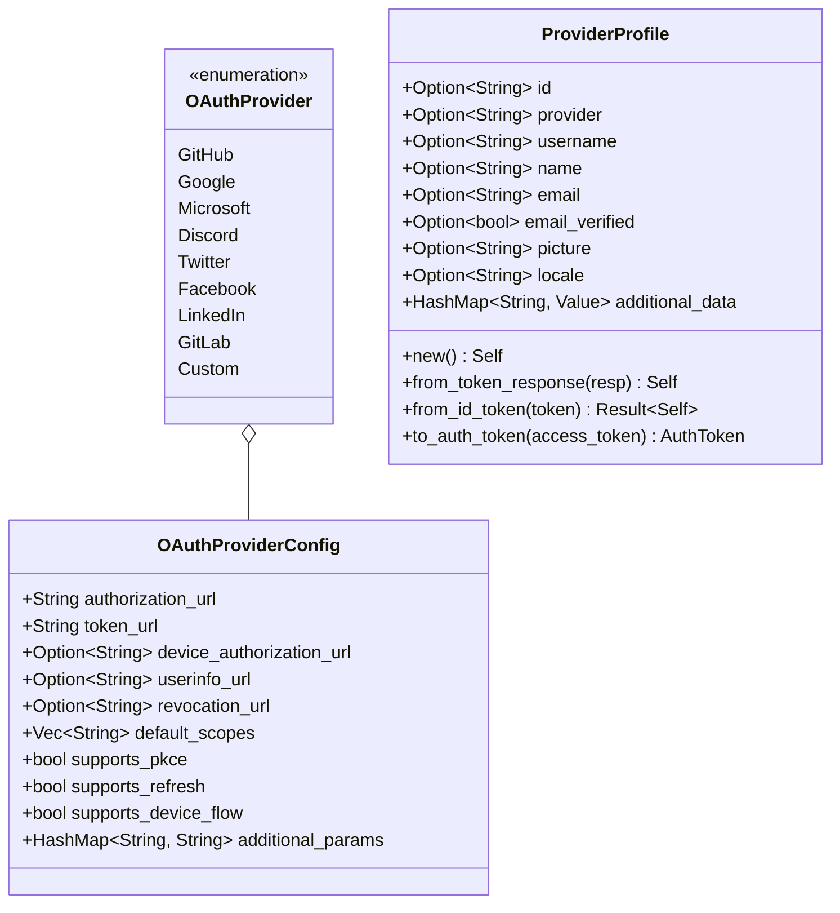

# Package: providers

> `src/providers.rs` — OAuth2 external provider definitions and user profile mapping

> [← 05-user-context](05-user-context.md) · [index](23-cross-package.md) · [07-methods →](07-methods.md)

> **Canonical provider profile type.** Renamed from `UserProfile` to `ProviderProfile` to distinguish from `api::users::UserProfile`.

---

**Related:** [07-methods](07-methods.md) · [16-server-oidc](16-server-oidc.md) · [22-core](22-core.md)
