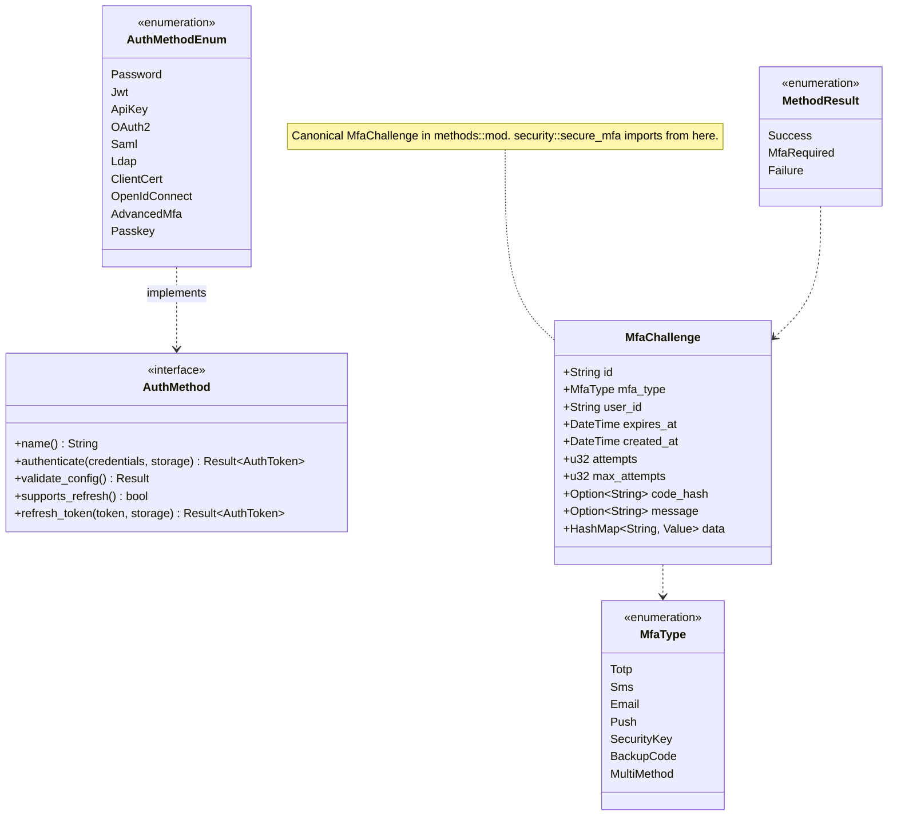

# Package: methods
> `src/methods/`

> [← 06-providers](06-providers.md) · [index](23-cross-package.md) · [08-permissions →](08-permissions.md)

---

**Related:** [04-storage](04-storage.md) · [03-tokens](03-tokens.md) · [12-security](12-security.md) · [08-permissions](08-permissions.md)
