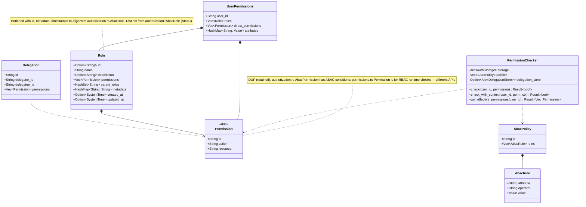

# Package: permissions
> `src/permissions.rs`

> [← 07-methods](07-methods.md) · [index](23-cross-package.md) · [09-authorization-legacy →](09-authorization-legacy.md)

---

**Related:** [04-storage](04-storage.md) · [09-authorization-legacy](09-authorization-legacy.md) · [10-authorization-enhanced](10-authorization-enhanced.md) · [22-core](22-core.md)
