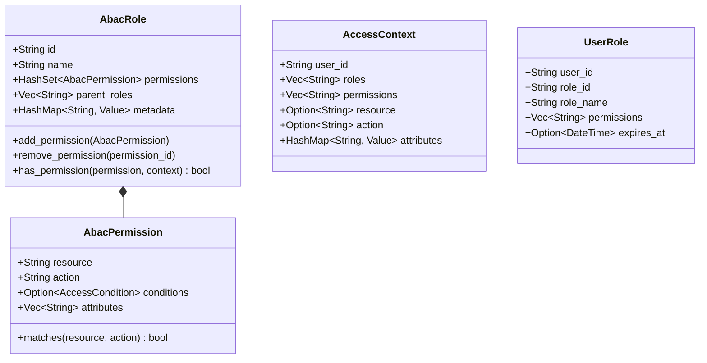

# Package: authorization (legacy)
> `src/authorization.rs` — original RBAC layer

> [← 08-permissions](08-permissions.md) · [index](23-cross-package.md) · [10-authorization-enhanced →](10-authorization-enhanced.md)

> **Note:** ABAC-capable RBAC layer used by `MemoryStorage` via the `AuthorizationStorage` trait.
> The enhanced RBAC service is in `authorization_enhanced/`.
> `AbacPermission` and `AbacRole` are distinct from `permissions::Permission` and `permissions::Role` (simpler runtime RBAC).

---

**Related:** [08-permissions](08-permissions.md) · [04-storage](04-storage.md) · [10-authorization-enhanced](10-authorization-enhanced.md)
