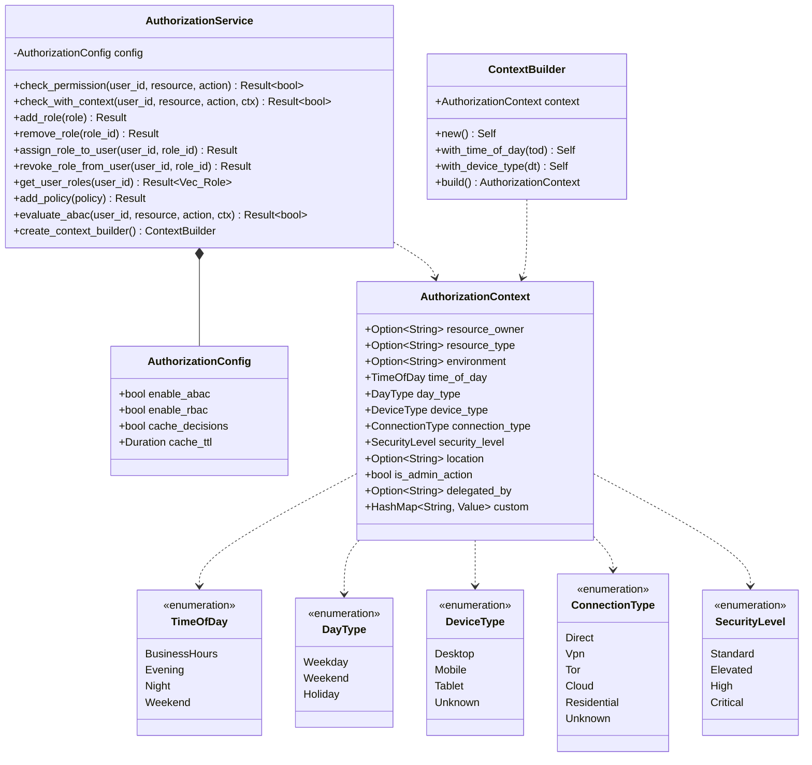

# Package: authorization_enhanced
> `src/authorization_enhanced/`

> [← 09-authorization-legacy](09-authorization-legacy.md) · [index](23-cross-package.md) · [11-session →](11-session.md)

---

**Related:** [09-authorization-legacy](09-authorization-legacy.md) · [08-permissions](08-permissions.md) · [22-core](22-core.md)
