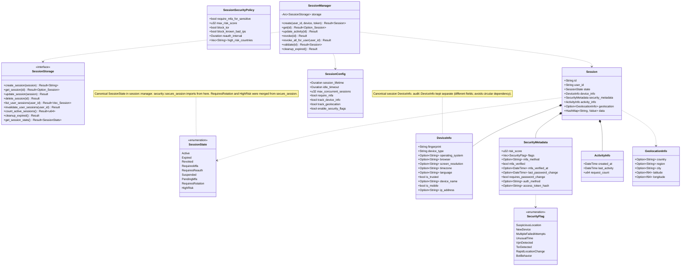

# Package: session
> `src/session/`

> [← 10-authorization-enhanced](10-authorization-enhanced.md) · [index](23-cross-package.md) · [12-security →](12-security.md)

---

**Related:** [04-storage](04-storage.md) · [12-security](12-security.md) · [22-core](22-core.md)
