# Package: security
> `src/security/`

> [← 11-session](11-session.md) · [index](23-cross-package.md) · [13-audit →](13-audit.md)

```mermaid
classDiagram
    class PasswordValidator {
        +usize min_length
        +bool require_uppercase
        +bool require_lowercase
        +bool require_digit
        +bool require_special
        +bool check_common_passwords
        +validate(password) PasswordValidation
        +check_strength(password) PasswordStrength
    }
    class PasswordValidation {
        +bool is_valid
        +Vec~String~ errors
        +PasswordStrength strength
        +u32 score
    }
    class PasswordStrength {
        <<enumeration>>
        VeryWeak
        Weak
        Fair
        Strong
        VeryStrong
        Excellent
    }
    class SecureJwtClaims {
        +String sub
        +String iss
        +String aud
        +i64 exp
        +i64 iat
        +i64 nbf
        +String jti
        +String scope
        +Option~Vec_String~ permissions
        +Option~Vec_String~ roles
        +Option~String~ client_id
        +HashMap~String, Value~ custom
    }
    class SecureJwtConfig {
        +JwtAlgorithm algorithm
        +String issuer
        +String audience
        +Duration token_lifetime
        +Duration refresh_lifetime
        +bool require_jti
        +bool check_revocation
    }
    class SecureJwtValidator {
        -DecodingKey decoding_key
        -SecureJwtConfig config
        +validate(token) Result~SecureJwtClaims~
        +validate_with_options(token, opts) Result~SecureJwtClaims~
        +extract_claims(token) Result~SecureJwtClaims~
        +is_revoked(jti) Result~bool~
    }
    class SecureSession {
        +String id
        +String user_id
        +SessionState state
        +DeviceFingerprint device
        +SecurityFlags flags
        +DateTime created_at
        +DateTime expires_at
        +DateTime last_activity
        +u32 risk_score
        +Option~String~ mfa_method
    }
    class SessionState {
        <<import: session::manager>>
        Active
        Expired
        Revoked
        RequiresMfa
        RequiresReauth
        Suspended
        PendingMfa
        RequiresRotation
        HighRisk
    }
    class DeviceFingerprint {
        +Option~String~ user_agent
        +Option~String~ ip_address
        +Option~String~ device_id
        +Option~String~ os
        +Option~String~ browser
        +Option~String~ fingerprint_hash
    }
    class SecurityFlags {
        +bool suspicious_location
        +bool new_device
        +bool multiple_failures
        +bool unusual_time
        +bool vpn_detected
        +bool tor_detected
    }
    class SecureSessionManager {
        -Arc~SecureSessionConfig~ config
        -DashMap~String, SecureSession~ sessions
        -Arc~TokenManager~ token_manager
        +create(user_id, device, token) Result~SecureSession~
        +get(id) Result~Option_SecureSession~
        +validate(id) Result~SecureSession~
        +rotate(id) Result~SecureSession~
        +revoke(id) Result
        +cleanup_expired() Result
    }
    class SecureSessionConfig {
        +Duration session_lifetime
        +Duration idle_timeout
        +u32 max_concurrent_sessions
        +bool require_mfa
        +bool check_device_binding
        +u32 max_risk_score
        +bool enable_rotation
        +Duration rotation_interval
    }
    class SecurityManager {
        -PasswordValidator password_validator
        -SecureJwtValidator jwt_validator
        +validate_password(pwd) PasswordValidation
        +check_password_strength(pwd) PasswordStrength
        +validate_jwt(token) Result~SecureJwtClaims~
        +hash_password(pwd) Result~String~
        +verify_password(pwd, hash) Result~bool~
    }
    class MfaConfig {
        +bool enabled
        +Vec~MfaType~ allowed_methods
        +bool require_for_admin
        +Duration totp_window
        +u32 max_attempts
        +Duration lockout_duration
    }
    class TotpConfig {
        +u32 digits
        +u64 period
        +String algorithm
        +u32 skew
    }
    class SecureMfaService {
        +generate_totp_secret() String
        +verify_totp(secret, code, config) Result~bool~
    }
    class SecurityPreset {
        <<enumeration>>
        Development
        Standard
        High
        Maximum
    }
    note for SessionState "Imported from session::manager. Duplicate SecureSessionState removed. RequiresRotation and HighRisk now part of canonical enum."
    note for DeviceFingerprint "DeviceFingerprint (security) is distinct from session::DeviceInfo and audit::DeviceInfo (different purpose: auth binding vs. session tracking vs. audit logging)"
    PasswordValidator ..> PasswordValidation
    PasswordValidator ..> PasswordStrength
    PasswordValidation ..> PasswordStrength
    SecureJwtValidator ..> SecureJwtClaims
    SecureJwtValidator *-- SecureJwtConfig
    SecureSession *-- DeviceFingerprint
    SecureSession *-- SecurityFlags
    SecureSession ..> SessionState
    SecureSessionManager ..> SecureSession
    SecureSessionManager *-- SecureSessionConfig
    SecurityManager *-- PasswordValidator
    SecurityManager *-- SecureJwtValidator
    MfaConfig ..> TotpConfig
    SecureMfaService ..> TotpConfig
```

---

**Related:** [03-tokens](03-tokens.md) · [07-methods](07-methods.md) · [11-session](11-session.md) · [22-core](22-core.md)
