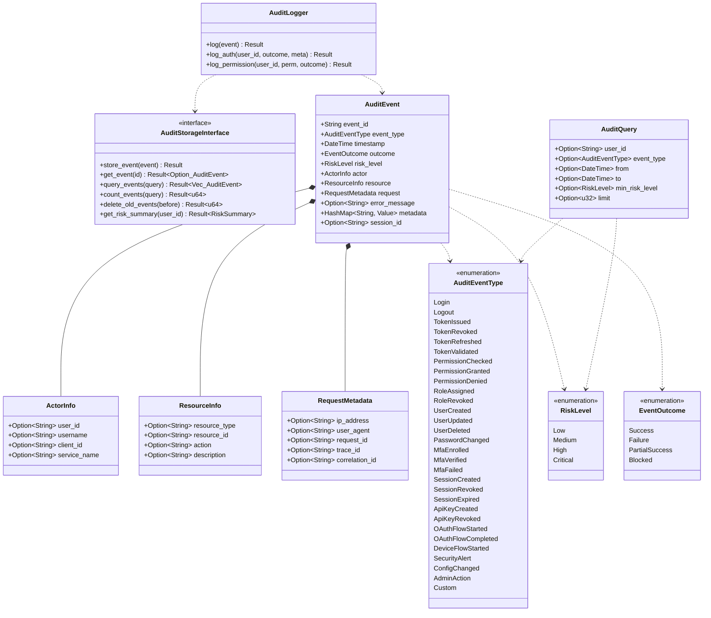

# Package: audit
> `src/audit/`

> [← 12-security](12-security.md) · [index](23-cross-package.md) · [14-oauth2-domain →](14-oauth2-domain.md)

---

**Related:** [04-storage](04-storage.md) · [20-api-layer](20-api-layer.md) · [21-admin](21-admin.md) · [22-core](22-core.md)
