# Package: oauth2 domain (Layer 2)

> `src/server/oauth/oauth2_server.rs` and `src/server/oauth/oauth2_enhanced_storage.rs` — canonical OAuth domain/server types re-exported from `crate::oauth2_server`
> [← 13-audit](13-audit.md) · [index](23-cross-package.md) · [15-server-layer →](15-server-layer.md)

```mermaid
classDiagram
    class GrantType {
        <<enumeration>>
        AuthorizationCode
        ClientCredentials
        RefreshToken
        DeviceCode
        JwtBearer
    }
    class ResponseType {
        <<enumeration>>
        Code
        Token
        IdToken
    }
    class ClientType {
        <<dup>>
        <<enumeration>>
        Confidential
        Public
    }
    class OAuth2Config {
        +Duration auth_code_lifetime
        +Duration access_token_lifetime
        +Duration refresh_token_lifetime
        +bool require_pkce
        +bool allow_refresh_tokens
        +Vec~GrantType~ allowed_grant_types
        +Vec~String~ allowed_response_types
    }
    class TokenRequest {
        +GrantType grant_type
        +Option~String~ client_id
        +Option~String~ code
        +Option~String~ redirect_uri
        +Option~String~ client_secret
        +Option~String~ refresh_token
        +Option~String~ username
        +Option~String~ password
        +Option~String~ code_verifier
        +Option~String~ scope
        +Option~String~ device_code
    }
    class TokenResponse {
        +String access_token
        +String token_type
        +Option~u64~ expires_in
        +Option~String~ refresh_token
        +Option~String~ scope
        +Option~String~ id_token
    }
    class AuthorizationRequest {
        +String response_type
        +String client_id
        +Option~String~ redirect_uri
        +Option~String~ scope
        +Option~String~ state
        +Option~String~ code_challenge
        +Option~String~ code_challenge_method
        +Option~String~ nonce
    }
    class OAuth2Server {
        -Arc~EnhancedTokenStorage~ storage
        -OAuth2Config config
        +authorize(client_id, req) Result~String~
        +exchange_code(req) Result~TokenResponse~
        +refresh(req) Result~TokenResponse~
        +revoke(token) Result
        +introspect(token) Result~Value~
        +device_authorize(client_id, scope) Result~Value~
        +device_token(device_code) Result~TokenResponse~
        +client_credentials(req) Result~TokenResponse~
    }
    class EnhancedTokenStorage {
        -DashMap~String, RefreshToken~ refresh_tokens
        -DashMap~String, EnhancedAuthorizationCode~ auth_codes
        -DashMap~String, EnhancedClientCredentials~ clients
        -DashMap~String, Value~ device_codes
        +store_refresh_token(token) Result
        +get_refresh_token(token) Result~Option_RefreshToken~
        +revoke_refresh_token(token) Result
        +store_auth_code(code) Result
        +get_auth_code(code) Result~Option_AuthorizationCode~
        +delete_auth_code(code) Result
        +get_client(id) Result~Option_ClientCredentials~
        +register_client(client) Result
        +store_device_code(code, data) Result
        +get_device_code(code) Result~Option_Value~
        +update_device_code(code, data) Result
    }
    class RefreshToken {
        +String token
        +String client_id
        +String user_id
        +Vec~String~ scopes
        +DateTime issued_at
        +DateTime expires_at
        +bool revoked
        +is_expired() bool
        +is_valid() bool
    }
    class EnhancedAuthorizationCode {
        +String code
        +String client_id
        +String user_id
        +Option~String~ redirect_uri
        +Vec~String~ scopes
        +DateTime created_at
        +DateTime expires_at
        +Option~String~ code_challenge
        +Option~String~ code_challenge_method
        +Option~String~ nonce
        +is_expired() bool
        +verify_pkce(verifier) bool
    }
    class EnhancedClientCredentials {
        +String client_id
        +String client_secret_hash
        +Vec~String~ allowed_scopes
        +Vec~String~ redirect_uris
        +ClientType client_type
        +bool active
        +verify_secret(secret) bool
        +has_redirect_uri(uri) bool
        +has_scope(scope) bool
        +is_pkce_required() bool
        +is_active() bool
    }
    class UserCredentials {
        +String user_id
        +String username
        +String password_hash
        +Vec~String~ roles
        +bool active
    }
    note for ClientType "Canonical ClientType in src/client.rs. Re-exported by server::mod, server::core::client_registry, oauth2_enhanced_storage"
    note for TokenRequest "Canonical in src/server/oauth/oauth2_server.rs. client_id is Option to support HTTP Basic auth. api::oauth2 re-exports these types."
    note for TokenResponse "Canonical in src/server/oauth/oauth2_server.rs. api::oauth2 re-exports."
    note for AuthorizationRequest "Canonical in src/server/oauth/oauth2_server.rs. api::oauth2 re-exports as AuthorizeRequest alias."
    OAuth2Server *-- EnhancedTokenStorage
    OAuth2Server *-- OAuth2Config
    OAuth2Server ..> TokenRequest
    OAuth2Server ..> TokenResponse
    OAuth2Server ..> AuthorizationRequest
    EnhancedTokenStorage *-- RefreshToken
    EnhancedTokenStorage *-- EnhancedAuthorizationCode
    EnhancedTokenStorage *-- EnhancedClientCredentials
    EnhancedClientCredentials ..> ClientType
```

---

**Related:** [03-tokens](03-tokens.md) · [04-storage](04-storage.md) · [15-server-layer](15-server-layer.md) · [20-api-layer](20-api-layer.md) · [22-core](22-core.md)
