# Package: server layer (Layer 3)

> `src/server/` — OAuth 2.1 server, also NOT wired to HTTP handlers
> [← 14-oauth2-domain](14-oauth2-domain.md) · [index](23-cross-package.md) · [16-server-oidc →](16-server-oidc.md)

```mermaid
classDiagram
    class OAuth2ServerConfig {
        +Duration auth_code_lifetime
        +Duration access_token_lifetime
        +Duration refresh_token_lifetime
        +bool require_pkce
    }
    class ServerOAuth2Server {
        -Arc~ClientRegistry~ client_registry
        -OAuth2ServerConfig config
        +authorize(req) Result~String~
        +exchange_code(req) Result~ServerTokenResponse~
        +refresh(req) Result~ServerTokenResponse~
        +revoke(token) Result
        +introspect(token) Result~Value~
        +client_credentials(req) Result~ServerTokenResponse~
    }
    class OAuth21SecurityConfig {
        +bool require_pkce
        +bool require_dpop
        +bool require_mtls
        +bool enable_par
        +bool enable_rar
    }
    class OAuth21Server {
        -Arc~ClientRegistry~ client_registry
        -OAuth21SecurityConfig security_config
        +authorize_par(req) Result~String~
        +exchange_with_dpop(req, dpop_proof) Result~ServerTokenResponse~
        +device_authorize(req) Result~DeviceAuthResponse~
        +device_token(req) Result~ServerTokenResponse~
    }
    class ClientRegistry {
        -DashMap~String, ClientConfig~ clients
        +register(config) Result
        +get(client_id) Option~ClientConfig~
        +update(config) Result
        +remove(client_id) Result
        +authenticate(client_id, secret) Result~ClientConfig~
        +validate_redirect_uri(client_id, uri) bool
        +validate_scope(client_id, scope) bool
    }
    class ClientConfig {
        +String client_id
        +Option~String~ client_secret_hash
        +Vec~String~ redirect_uris
        +Vec~String~ allowed_scopes
        +Vec~GrantType~ allowed_grant_types
        +ClientType client_type
        +bool require_pkce
        +bool active
    }
    class ClientRegistrationManager {
        -Arc~ClientRegistry~ registry
        -ClientRegistrationConfig config
        +register_client(req) Result~ClientRegistrationResponse~
        +update_client(client_id, req) Result
        +delete_client(client_id) Result
        +rotate_secret(client_id) Result~String~
    }
    class PARManager {
        +store_request(req) Result~String~
        +get_request(uri) Result~Option_AuthorizationRequest~
        +validate_request(uri) Result~AuthorizationRequest~
    }
    class DeviceAuthManager {
        +create_device_request(client_id, scope) Result~DeviceAuthResponse~
        +poll_device_token(device_code) Result~DeviceTokenResult~
        +approve_device(user_code, user_id) Result
        +deny_device(user_code) Result
    }
    class DpopManager {
        +verify_proof(proof, htm, htu, token) Result
        +bind_token(token, jwk_thumbprint) Result~String~
    }
    class JwtIntrospectionManager {
        -Arc~TokenManager~ token_manager
        +introspect(token) Result~IntrospectionResponse~
    }
    note for ClientConfig "Canonical source: src/client.rs. Re-exported by server::core::client_registry and server::mod. EnhancedClientCredentials is a separate storage-layer type with verify_secret(). api::ClientInfo (name, contact_email) is an API-layer DTO."
    ServerOAuth2Server *-- ClientRegistry
    ServerOAuth2Server *-- OAuth2ServerConfig
    OAuth21Server *-- ClientRegistry
    OAuth21Server *-- OAuth21SecurityConfig
    ClientRegistry *-- ClientConfig
    ClientRegistrationManager ..> ClientRegistry
    OAuth21Server ..> PARManager
    OAuth21Server ..> DeviceAuthManager
    OAuth21Server ..> DpopManager
    ServerOAuth2Server ..> JwtIntrospectionManager
```

---

**Related:** [14-oauth2-domain](14-oauth2-domain.md) · [16-server-oidc](16-server-oidc.md) · [17-server-security](17-server-security.md) · [03-tokens](03-tokens.md) · [22-core](22-core.md)
