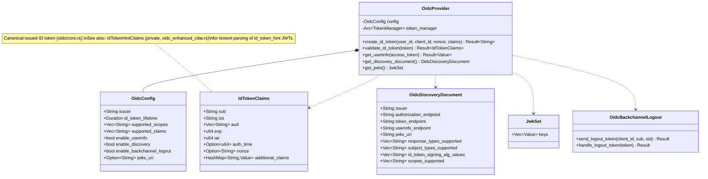

# Package: server OIDC
> `src/server/oidc/`

> [← 15-server-layer](15-server-layer.md) · [index](23-cross-package.md) · [17-server-security →](17-server-security.md)

---

**Related:** [15-server-layer](15-server-layer.md) · [03-tokens](03-tokens.md) · [06-providers](06-providers.md)
