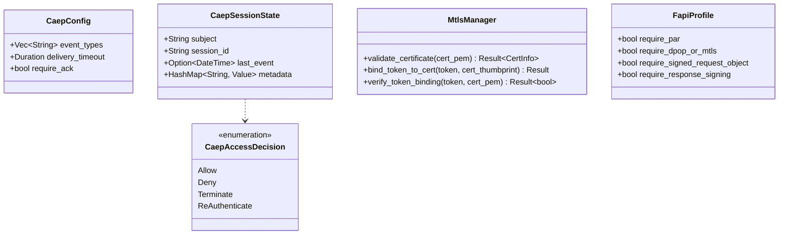

# Package: server security (CAEP / mTLS / FAPI)
> `src/server/security/`

> [← 16-server-oidc](16-server-oidc.md) · [index](23-cross-package.md) · [18-token-exchange →](18-token-exchange.md)

---

**Related:** [15-server-layer](15-server-layer.md) · [16-server-oidc](16-server-oidc.md)
