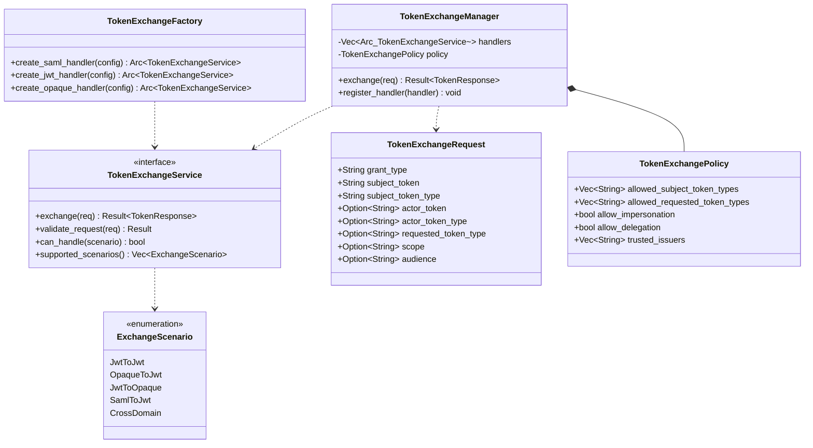

# Package: token exchange
> `src/token_exchange/`

> [← 17-server-security](17-server-security.md) · [index](23-cross-package.md) · [19-distributed →](19-distributed.md)

---

**Related:** [03-tokens](03-tokens.md) · [14-oauth2-domain](14-oauth2-domain.md) · [22-core](22-core.md)
