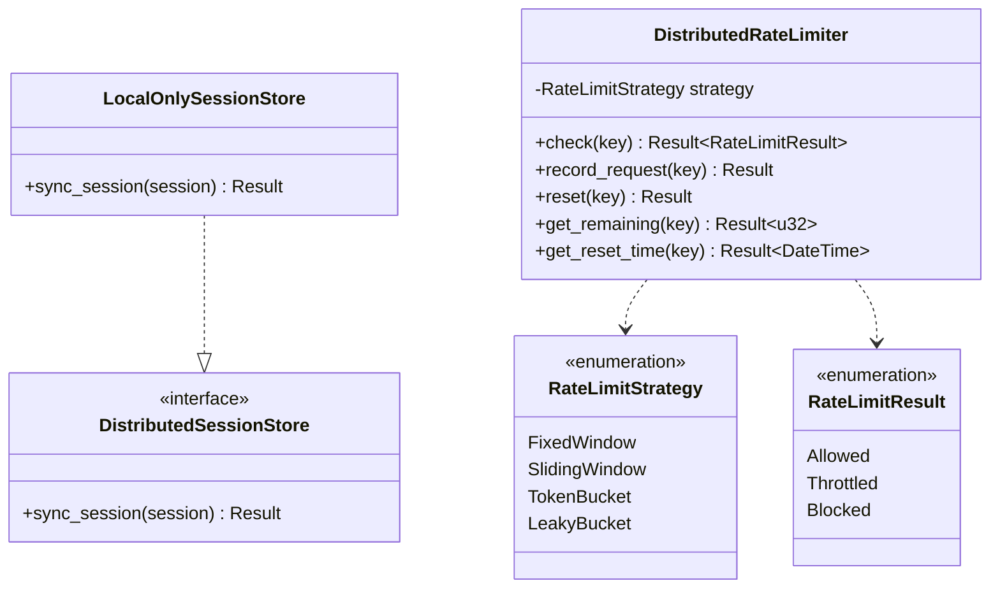

# Package: distributed
> `src/distributed/`

> [← 18-token-exchange](18-token-exchange.md) · [index](23-cross-package.md) · [20-api-layer →](20-api-layer.md)

---

**Related:** [11-session](11-session.md) · [22-core](22-core.md)
