# Package: api layer

> `src/api/` — HTTP request/response types (Axum handlers)
> [← 19-distributed](19-distributed.md) · [index](23-cross-package.md) · [21-admin →](21-admin.md)

```mermaid
classDiagram
    class ApiServer {
        -ApiServerConfig config
        -Arc~Cinaauth~ cinaauth
        +new(framework) Self
        +with_config(framework, config) Self
        +start() Result
        +build_router() Result~Router~
        +config() ApiServerConfig
        +address() String
    }
    class ApiServerConfig {
        +String host
        +u16 port
        +CorsConfig cors
        +usize max_body_size
        +bool enable_tracing
    }
    class ApiState {
        -Arc~Cinaauth~ framework
        -Arc~DistributedRateLimiter~ rate_limiter
        +new(framework) Result~ApiState~
    }
    class ApiResponse {
        +bool success
        +Option~Value~ data
        +Option~String~ error
        +Option~String~ message
        +ok(data) Self
        +error(message) Self
        +created(data) Self
        +no_content() Self
        +paginated(data, total, page, size) Self
    }
    class ApiError {
        +String error
        +String error_description
        +Option~String~ error_uri
    }
    class OAuthError {
        +String error
        +String error_description
        +Option~String~ state
    }
    class AuthorizeRequest {
        <<re-export>>
        +String response_type
        +String client_id
        +Option~String~ redirect_uri
        +Option~String~ scope
        +Option~String~ state
        +Option~String~ code_challenge
        +Option~String~ code_challenge_method
        +Option~String~ nonce
    }
    class ClientInfo {
        +String client_id
        +String name
        +Vec~String~ redirect_uris
        +Vec~String~ allowed_scopes
        +Option~String~ contact_email
    }
    class ApiTokenRequest {
        +String grant_type
        +Option~String~ code
        +Option~String~ redirect_uri
        +Option~String~ client_id
        +Option~String~ client_secret
        +Option~String~ refresh_token
        +Option~String~ scope
    }
    class ApiTokenResponse {
        +String access_token
        +String token_type
        +Option~u64~ expires_in
        +Option~String~ refresh_token
        +Option~String~ scope
    }
    class LoginRequest {
        +String username
        +String password
        +Option~String~ mfa_code
        +Option~String~ client_id
    }
    class LoginResponse {
        +String access_token
        +Option~String~ refresh_token
        +u64 expires_in
        +Option~String~ mfa_required
    }
    class IntrospectRequest {
        +String token
        +Option~String~ token_type_hint
    }
    class IntrospectResponse {
        +bool active
        +Option~String~ sub
        +Option~String~ client_id
        +Option~String~ username
        +Option~i64~ exp
        +Option~i64~ iat
        +Option~String~ scope
        +Option~String~ token_type
    }
    class PARRequest {
        +String response_type
        +String client_id
        +Option~String~ redirect_uri
        +Option~String~ scope
        +Option~String~ state
        +Option~String~ code_challenge
        +Option~String~ code_challenge_method
        +Option~String~ nonce
    }
    class PARResponse {
        +String request_uri
        +u64 expires_in
    }
    class HealthResponse {
        +String status
        +String version
        +DateTime timestamp
        +HashMap~String, ServiceHealth~ services
        +Option~u64~ uptime_seconds
    }
    class ServiceHealth {
        +String status
        +Option~String~ message
        +Option~u64~ latency_ms
    }
    note for AuthorizeRequest "pub use alias: api::AuthorizeRequest = oauth2_server::AuthorizationRequest. Canonical definition in src/server/oauth/oauth2_server.rs."
    note for ApiTokenRequest "API-layer DTO; the canonical OAuth2 token request type is oauth2_server::TokenRequest, re-exported via api::TokenRequest."
    note for ApiTokenResponse "API-layer DTO; the canonical OAuth2 token response type is oauth2_server::TokenResponse, re-exported via api::TokenResponse."
    ApiServer *-- ApiState
    ApiServer *-- ApiServerConfig
    ApiState ..> ApiResponse
    ApiServer ..> HealthResponse
    HealthResponse *-- ServiceHealth
```

---

**Related:** [22-core](22-core.md) · [14-oauth2-domain](14-oauth2-domain.md) · [15-server-layer](15-server-layer.md) · [13-audit](13-audit.md) · [21-admin](21-admin.md)
