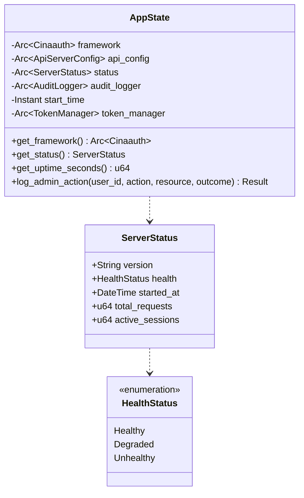

# Package: admin / bin
> `src/bin/` — admin server binary types

> [← 20-api-layer](20-api-layer.md) · [index](23-cross-package.md) · [22-core →](22-core.md)

---

**Related:** [20-api-layer](20-api-layer.md) · [22-core](22-core.md) · [13-audit](13-audit.md)
