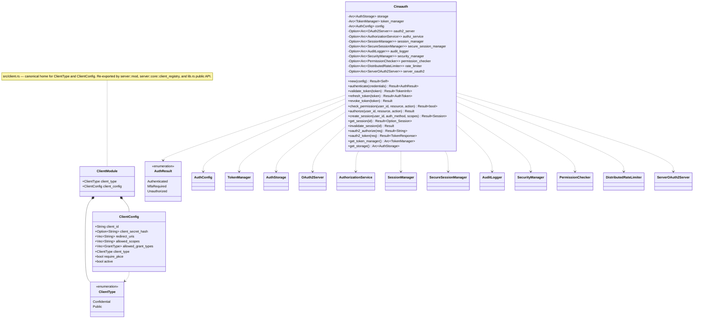

# Package: core (Cinaauth root)

> `src/lib.rs` — the root public API type
> [← 21-admin](21-admin.md) · [index](23-cross-package.md) · [23-cross-package →](23-cross-package.md)

---

**Related:** [02-config](02-config.md) · [03-tokens](03-tokens.md) · [04-storage](04-storage.md) · [11-session](11-session.md) · [13-audit](13-audit.md) · [14-oauth2-domain](14-oauth2-domain.md) · [15-server-layer](15-server-layer.md) · [23-cross-package](23-cross-package.md)
