# Cross-package relationships & duplication map

> Summary of how all 23 packages interconnect, and the 10 type deduplication resolutions
> [← 22-core](22-core.md)

## Deduplication status

| Type | Status | Canonical location | Resolution |
| --- | --- | --- | --- |
| `UserProfile` | RESOLVED | `src/providers.rs` | Renamed to `ProviderProfile`; all callers updated (auth.rs, integrations, tokens, profile_utils, tests) |
| `TokenRequest` | RESOLVED | `src/server/oauth/oauth2_server.rs` | `client_id: Option<String>` with `#[serde(default)]`; `api/oauth2.rs` re-exports via `pub use` |
| `TokenResponse` | RESOLVED | `src/server/oauth/oauth2_server.rs` | `api/oauth2.rs` re-exports canonical type via `pub use` |
| `AuthorizationRequest` | RESOLVED | `src/server/oauth/oauth2_server.rs` | `api::AuthorizeRequest` is a `pub use` alias for `oauth2_server::AuthorizationRequest` |
| `ClientType` | RESOLVED | `src/client.rs` | Canonical enum extracted; re-exported by `server::mod`, `server::core::client_registry`, `lib.rs` |
| `ClientConfig` | RESOLVED | `src/client.rs` | Full struct extracted; `server::core::client_registry` uses `pub use crate::client` |
| `SessionState` | RESOLVED | `src/session/manager.rs` | Merged `RequiresRotation`/`HighRisk` variants in; `security::secure_session` imports from session |
| `DeviceInfo` | PARTIAL | `src/session/manager.rs` | `session::DeviceInfo` enriched (`is_mobile`, `ip_address`); `audit::DeviceInfo` kept separate to avoid circular dependency |
| `MfaChallenge` | RESOLVED | `src/methods/mod.rs` | Enriched with `created_at`, `attempts`, `max_attempts`, `code_hash`; `security::secure_mfa` imports from methods |
| `Permission`+`Role` | RESOLVED | `src/authorization.rs` | `authorization::Permission` → `AbacPermission`; `authorization::Role` → `AbacRole`; `permissions::Permission/Role` retained for simpler runtime RBAC; exported as `AuthzPermission`/`AuthzRole` aliases in `prelude.rs` |
| `OidcSessionState` | RESOLVED | `src/server/oidc/` | Renamed from `SessionState` to `OidcSessionState` to avoid collision with canonical `session::SessionState` |

---

## Cross-package dependency diagram

> All arrows show `From ..> To` (From depends on To)

```mermaid
classDiagram
    class core_Cinaauth
    class config_AuthConfig
    class tokens_TokenManager
    class storage_AuthStorage
    class oauth2_OAuth2Server
    class authz_AuthorizationService
    class session_SessionManager
    class security_SecureSessionManager
    class audit_AuditLogger
    class security_SecurityManager
    class permissions_PermissionChecker
    class distributed_RateLimiter
    class server_ServerOAuth2Server
    class api_ApiServer
    class api_ApiState
    class server_ClientRegistry
    class oidc_OidcProvider
    class tokenex_TokenExchangeManager
    class methods_AuthMethodEnum

    core_Cinaauth ..> config_AuthConfig
    core_Cinaauth ..> tokens_TokenManager
    core_Cinaauth ..> storage_AuthStorage
    core_Cinaauth ..> oauth2_OAuth2Server
    core_Cinaauth ..> authz_AuthorizationService
    core_Cinaauth ..> session_SessionManager
    core_Cinaauth ..> security_SecureSessionManager
    core_Cinaauth ..> audit_AuditLogger
    core_Cinaauth ..> security_SecurityManager
    core_Cinaauth ..> permissions_PermissionChecker
    core_Cinaauth ..> distributed_RateLimiter
    core_Cinaauth ..> server_ServerOAuth2Server

    api_ApiServer ..> api_ApiState
    api_ApiState ..> core_Cinaauth
    api_ApiState ..> audit_AuditLogger

    server_ServerOAuth2Server ..> server_ClientRegistry
    server_ServerOAuth2Server ..> tokens_TokenManager
    oauth2_OAuth2Server ..> storage_AuthStorage
    oauth2_OAuth2Server ..> tokens_TokenManager

    oidc_OidcProvider ..> tokens_TokenManager
    tokenex_TokenExchangeManager ..> tokens_TokenManager
    methods_AuthMethodEnum ..> storage_AuthStorage

    session_SessionManager ..> storage_AuthStorage
    security_SecureSessionManager ..> tokens_TokenManager
    permissions_PermissionChecker ..> storage_AuthStorage
    audit_AuditLogger ..> storage_AuthStorage
```

---

## All diagrams

| #   | File                                                      | Package                                         |
| --- | --------------------------------------------------------- | ----------------------------------------------- |
| 1   | [01-errors](01-errors.md)                                 | `src/error.rs` — error types                    |
| 2   | [02-config](02-config.md)                                 | `src/config/` — configuration                   |
| 3   | [03-tokens](03-tokens.md)                                 | `src/tokens.rs` — JWT / token lifecycle         |
| 4   | [04-storage](04-storage.md)                               | `src/storage/` — storage trait + backends       |
| 5   | [05-user-context](05-user-context.md)                     | `src/user_context.rs` — in-memory session store |
| 6   | [06-providers](06-providers.md)                           | `src/providers.rs` — OAuth2 provider configs    |
| 7   | [07-methods](07-methods.md)                               | `src/methods/` — auth method trait + MFA        |
| 8   | [08-permissions](08-permissions.md)                       | `src/permissions.rs` — Permission, Role, ABAC   |
| 9   | [09-authorization-legacy](09-authorization-legacy.md)     | `src/authorization.rs` — legacy RBAC            |
| 10  | [10-authorization-enhanced](10-authorization-enhanced.md) | `src/authorization_enhanced/` — ABAC service    |
| 11  | [11-session](11-session.md)                               | `src/session/` — session management             |
| 12  | [12-security](12-security.md)                             | `src/security/` — password, JWT, MFA            |
| 13  | [13-audit](13-audit.md)                                   | `src/audit/` — audit logging                    |
| 14  | [14-oauth2-domain](14-oauth2-domain.md)                   | `src/oauth2.rs` — OAuth2 domain (Layer 2)       |
| 15  | [15-server-layer](15-server-layer.md)                     | `src/server/` — OAuth 2.1 server (Layer 3)      |
| 16  | [16-server-oidc](16-server-oidc.md)                       | `src/server/oidc/` — OIDC provider              |
| 17  | [17-server-security](17-server-security.md)               | `src/server/security/` — CAEP, mTLS, FAPI       |
| 18  | [18-token-exchange](18-token-exchange.md)                 | `src/token_exchange/` — RFC 8693 exchange       |
| 19  | [19-distributed](19-distributed.md)                       | `src/distributed/` — distributed rate limiter   |
| 20  | [20-api-layer](20-api-layer.md)                           | `src/api/` — HTTP request/response DTOs         |
| 21  | [21-admin](21-admin.md)                                   | `src/bin/` — admin server binary types          |
| 22  | [22-core](22-core.md)                                     | `src/lib.rs` — Cinaauth root type          |
| 23  | [23-cross-package](23-cross-package.md)                   | cross-package deps + duplication map            |
